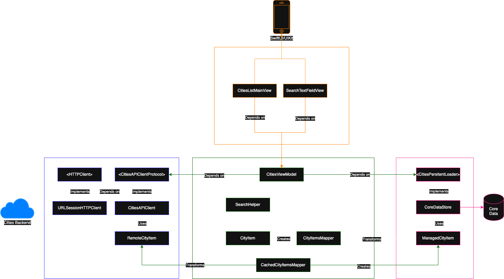

# Architecture & Design

## Model-View-ViewModel
This solution adopts the MMVM (Model-View-ViewModel) architectural pattern for this feature. MVVM promotes separation of concerns allowing the codebase to be more testable, flexible and scalable.

## Composable architecture
Composable architecture is adopted to showcase a Dependency Injection clear intention and scalability flexbility. This is criticial to have a futureproof architecture that allows to integrate future important changes in a painless way. 

---

## Overview diagram

## Modules
The modules and their contributors were distributed as follows:
* **API**
	* `HTTPClient`: Protocol that contains the required contract to be implemented by Session clients. As it's feature agnostic, it only handles `Data` and `HTTPURLResponse` objects
	* `URLSessionHTTPClient`: Implementation instance of the `HTTPClient` protocol that allows to use an specific session according to the project needs. In this case, we are using the `URLSession` `.default` API from Swift
	* `CitiesAPIClientProtocol`: Protocol that contains the required methods to be implemented by the client
	* `CitiesAPIClient`: Implementation instance of the `CitiesAPIClientProtocol` that contains the specific business logic and attributes to communicate with the Backend service that provides the required information (cities)
	* `RemoteCityItem`: DTO model object that declares the required properties to be decoded from the JSON representation coming from the Backend service
* **Feature**
	* `CitiesViewModel`: Instance responsible for preparing and managing the data to be displayed in the UI, as well as handling UI states. In collaboration with the API Client and Persistence Store instances, it will handle fetching and storing. Also, it will take care of necessary mapping and formatting of the information 
	* `SearchHelper`: Implementations instance that is in charge of performing the search operation with its provided inner business rules.
	* `CityItem`: Model that contains the required formatted information to be displayed in the UI, such a `name`, `country`, `location`
	* `CachedCityItemsMapper`: Extension of `CachedCityItem` that creates a feature representation from the cached representation. Necessary to avoid tight coupling between modules
	* `RemoteCityItemsMapper`: Extension of `RemoteCityItem` that creates a cache model representation from the remote representation. Necessary to avoid tight coupling between modules
* **Persistence**
	* `CitiesPersistentLoader`: Protocol that defines the abstraction methods to be implemented by any storage or cache solution to be used, such as retrieving, saving, deleting, etc
	* `CoreDataStore:`: Implementation instance in charge of handling fetching/saving requests for Core Data storage
	* `CachedCityItem`: Model for the local storage representation of the items to make it agnostic of any other module. Safely handled by the Context
* **UI**
	* `CitiesListMainView`: View instance in charge of displaying the given items data in a list manner
	* `SearchTextFieldView`: View instance in charge of receiving user events, such as typing or deleting a char while searching. And transform this events into actions for the ViewModel so the search solution can be performed
