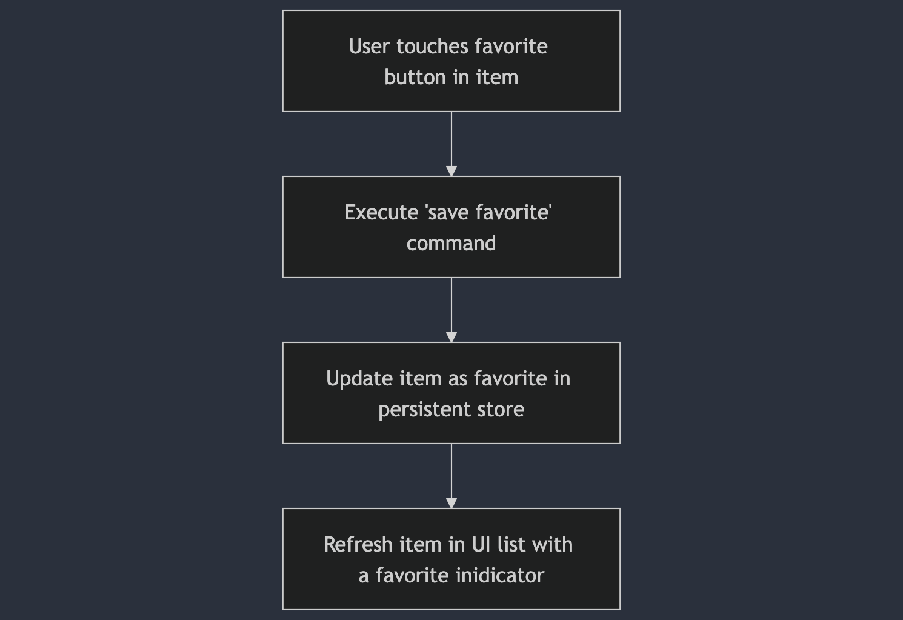

# Use Cases & Data Flow

## Load Cities from Remote and Save Use Case
Data:
-   URL

### Primary course (happy path):

1. Execute "Retrieve Cities" command with above data.
2. System downloads data from the URL.
3. System validates downloaded data.
4. System creates citiy items decoding from valid data.
5. System creates cached items to be inserted
6. System inserts items into Persistent store
7. System delivers ordered city items to be displayed

### Invalid data – error course (sad path):

1.  System delivers invalid data error.

### No connectivity – error course (sad path):

1.  System delivers connectivity error.

### Flow Diagram

### Sequence diagram
[](https://mermaid.live/edit#pako:eNrNlstu2zAQRX9lwHW6azdaBCjioHGRF6y4CApvBtQ4JkKRKknFMYL8e4ei7NKx5LRZ1RtL4szh5R2-XoS0FYlCePrVkpE0UfjgsF4Y4B_KYB3MPbn03qALSqoGTYBSkqEJaXrAQIfNZyoo8pfKhytU5oei9VhMbLtiEXqgD0InVxekmyEFKf3r7fRMKzLhMGA-uyzJe2XNxd3d7VjUNYW1dY_wvby5hhl52zo5NCDraIIBS7bkSHNqiZZ9Oj3d86iAm4aMB2waWLKtYUWwVM4HCKruiXsJDHjjUAHnzyTbQLAQMwpO0ROlEFg6W4Oj2nIxBEhb12iqBH0D2WF3zhWwhYFMtATSmxywC2fAkLMFfKMAFXsA3HU0n81srPH92IZyGDVofwETuzbaYpWA3egYkEiDKaOqeGytY9-7aPSQVWlY0ZA7HaGTEixUFBdNZM06n2AaqI6mNY48Z2Bg5Jh1ByXd0n0rJathjG91gLUKqwQerWI-IyOHVzDPpoUo8anX9GcqJJ7KeHl2RisgpvsUCsrAGUqeqfuDSzQ0YHllpi-zJHsfPqQyjjbL2w475Y9oG_WMpVa9VC6HthL1kTrk7uV7SwFT4wMvY8XLLnMqFnuptIYn1KoCxi7VM_njyyrf8wqYN1VkzqfAHfADE1Wl6bAcB7lxQvuobaJ8o3HzpyIIWvmt1cims3pynZvnzvHWknv5fjF8Vg06kv9uNQaTP-pSB9unHHUnde6lI-prTtrTbq84z3Ef20A-398Dd_GF_2IzlCy19Vvmv24m42b91W7RzUi2qupBYdPQ_-B5f-iIE1GTq1FVfLd4iZ8Wgg88PudEwY8VuseFWJhXjsM22HJjpCiCa-lEONs-rESxRC7fiWg7lf2tZPeVj9yf1tbbFKoUz82rdJPpLjSvvwHIQRhn)

## Load Cities from Local storage Use Case

### Primary course (happy path):

1. System verifies there is already cached data
2. Execute "Retrieve Cities" command from Local storage
3. System retrieves cached items
4. System creates citiy items mapping from cached data.
5. System delivers ordered city items to be displayed

### Retrieval error course (sad path):

1.  System delivers error.

### Empty cache course (sad path):

1.  System delivers no cached items.

### Flow Diagram

## Perform search Use Case
### Primary course (happy path):
1. System receives input data from user
2. Execute "Perform search" command on cached items
3. System returns items that matches with valid prefix token
4. System refreshes list with filtered items

### No Search results course:
1. System delivers no items (empty list)

### Flow Diagram

## Adding to favorites Use Case
### Course:
1. System receives UI event from user
2. Execute "Save favorite" command on cached items
3. System perform persistent storage update
4. System updates UI marking the favorite item

### Flow Diagram

## Removing from favorites Use Case
### Course:
1. System receives UI event from user
2. Execute "Remove favorite" command on cached items
3. System perform persistent storage update
4. System updates UI unmarking the favorite item

### Flow Diagram

